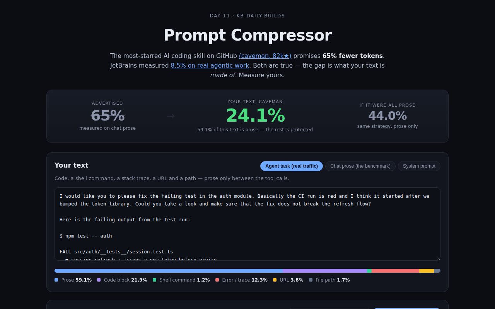

<div align="center">

# Prompt Compressor — What Token Savings Actually Cost You

**The most-starred AI coding skill on GitHub promises 65% fewer tokens. Paste your own text and measure what it actually saves — and what meaning it quietly drops.**

[](https://github.com/kbipul/prompt-compressor/actions/workflows/ci.yml)
[](https://kbipul.github.io/prompt-compressor/)

`Day 11` of **[kb-daily-builds](https://github.com/kbipul/kb-daily-builds)** — one AI project a day.

</div>

## What it does

[`JuliusBrussee/caveman`](https://github.com/JuliusBrussee/caveman) is the most-starred AI coding agent skill on GitHub — ~82k stars, +2,851 the day I built this — and it advertises a **65% token reduction** by telling the model to talk like a caveman. JetBrains then [measured it on real agentic tasks and got 8.5%](https://blog.jetbrains.com/ai/2026/07/speak-to-ai-agents-like-cavemen-tosave-tokens/).

Both numbers are honest. The gap is that **65% is measured on chat prose**, and real agent traffic is mostly code, diffs, shell commands, stack traces and exact error strings — content any sane compressor leaves byte-for-byte alone. The advertised percentage only ever applies to the prose fraction of your text.

This tool makes that fraction visible. It segments your text by content type, compresses **only** the prose, and reports three numbers side by side: what was advertised, what you actually get, and what you'd get if your text really were all prose. Then it measures — with a sentence-transformer running in your browser — how much meaning the saving cost you.



<sub>The screenshot is captured by this repo's CI on a GitHub runner (the build sandbox has no browser) and committed back automatically — it appears within a few minutes of first publish.</sub>

## Try it

**[Live demo →](https://kbipul.github.io/prompt-compressor/)** — runs fully in your browser, nothing to install, no API key.

```bash
git clone https://github.com/kbipul/prompt-compressor.git
cd prompt-compressor
npm ci
npm test        # 70 tests
npm run dev     # http://localhost:5173
```

## How it works

Three decisions carry the whole thing.

**1. Segment before you compress.** The input is split into typed segments — prose, fenced code, shell commands, stack traces, URLs, file paths — and only prose is marked compressible. Everything else is copied through untouched. A fenced block containing prose stays code (it was quoted for a reason), and an *unterminated* fence is still treated as code rather than silently reworded.

```
input ──► segment() ──► [prose][code][command][error][prose] ──┐
                             │      │        │        │        │
                        compress   copy     copy     copy      │
                             └──────┴────────┴────────┴────────┴──► reassemble()
```

**2. Report the total, not the flattering slice.** `savedShare` divides tokens saved by *total* tokens; `proseSavedShare` divides by prose tokens only. The first is what your bill sees. The second is what gets put on a landing page. Showing both is the product.

**3. Fidelity is a progressive enhancement.** Token and cost maths are pure functions over a real BPE tokenizer (`o200k_base`) — instant, offline, no model. The meaning-loss score embeds original vs compressed with `all-MiniLM-L6-v2` via transformers.js, and only loads that ~25MB model when you click. First paint never waits on a download.

## Build notes — what I learned

**The headline number was never a lie — it was a measurement on a different population.** I went in expecting to debunk the 65% claim and came out with more respect for it. On my chat-prose fixture, caveman-style compression lands at **50.9%** — the right ballpark. The claim is reproducible. It just isn't *transferable*, because the thing being measured (prose) is a minority of the thing people actually send (agent traffic). That reframing is the whole build: the interesting bug isn't a wrong number, it's a number measured on the wrong distribution and then generalised. I see that failure mode constantly in vendor benchmarks, and it's much easier to argue about when you can show it.

**The segmenter is the product; the compressor is a toy.** I spent most of the session on `segment.ts` and almost none on the compression strategies, which is the inverse of what I'd have guessed. The strategies are ~150 lines of regex and a stopword set. But the moment you decide "code is protected", you inherit a pile of genuinely hard questions: is an indented block code or a quoted paragraph? Is `packages/auth/package.json` a path or a sentence? What about a fence that never closes? Every one of those is a judgement call that moves the headline number, and every one is a place where I could have quietly cheated to make the gap look bigger. The tests exist mostly to stop me doing that — `compress()` on pure code asserts an exact **0%** saving, and the round-trip test proves `reassemble(segment(x)) === x`.

**My fixture is more honest than my thesis wanted.** JetBrains measured 8.5% on real agentic work; my agent-task fixture shows **24.1%**. I could have padded it with more code until it hit 8.5%, and I didn't — a user's task message genuinely is more prose-heavy than a full agent transcript with dozens of tool results. So the fixture shows 59% prose and reports 24%, and the README says why rather than manufacturing a scarier number. If you paste a real transcript in, you'll see it fall further. That's the point of it being a tool instead of a blog post.

**Embedding similarity is a weaker instrument than it looks.** Cosine similarity between the original and compressed text measures *topical* drift. It cannot see that you dropped a "don't". A compressed prompt that keeps every noun and inverts one negation scores ~0.97 and would still ruin your afternoon. I nearly shipped it as "Fidelity" with a green checkmark before deciding the honest move was to keep the number but say plainly, in the UI and here, what it does not measure. A tool that overstates its own certainty is exactly the thing I built this to complain about.

**What I'd do differently:** the real fidelity test is behavioural, not geometric — run the original and compressed prompt through the same model and diff the outputs. That needs an API key, which breaks the zero-setup demo. The right answer is probably a `byok` mode alongside the client-side one, which is a better build than a bigger regex list.

## Stack

| Layer | Choice |
|---|---|
| UI | React 18 + TypeScript 5 |
| Tokenizer | `gpt-tokenizer` (`o200k_base`) |
| Embeddings | `@huggingface/transformers` (`Xenova/all-MiniLM-L6-v2`), loaded on demand |
| Diff | hand-rolled word-level LCS (no dependency) |
| Build / test | Vite 6 · Vitest 2 (70 tests) |
| Hosting | GitHub Pages, static, no backend |

## Caveats, stated plainly

- **Input tokens only.** Compression cannot save output tokens. Quoting output prices here would inflate the saving, so they are absent.
- **Tokenizer approximation.** Everything is counted with `o200k_base`; per-vendor `tokenMultiplier` values in `src/lib/pricing.ts` approximate each vendor's real tokenizer. They are estimates.
- **Prices drift.** Every model in `pricing.ts` carries an `asOf` date. They were current in mid-July 2026 and will rot.
- **Fidelity ≠ correctness.** See above. It measures topical drift, not instruction fidelity.
- **The strategies are rule-based, not an LLM.** Deliberately: an LLM compressor needs a key, and asking a model to grade its own rewrite makes the measurement circular.

---

<div align="center"><sub>
Built by <a href="https://www.kumarbipul.com"><b>Kumar Bipul</b></a> ·
IT Director → AI/ML · <a href="https://github.com/kbipul">github.com/kbipul</a>
</sub></div>
