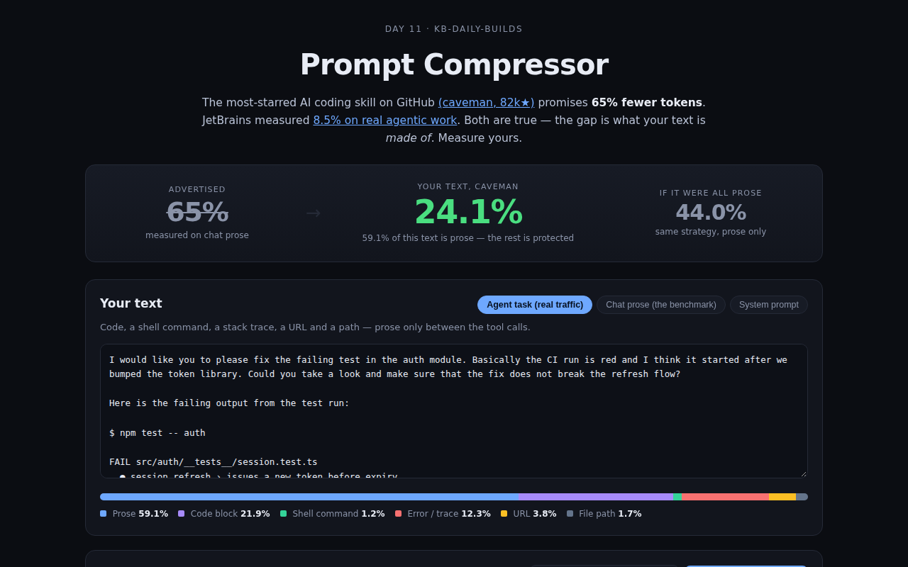

<div align="center">

# Prompt Compressor — What Token Savings Actually Cost You

**The most-starred AI coding skill on GitHub promises 65% fewer tokens. Paste your own text and measure what it actually saves — and what meaning it quietly drops.**

[](https://github.com/kbipul/prompt-compressor/actions/workflows/ci.yml)
[](https://kbipul.github.io/prompt-compressor/)

`Day 11` of **[kb-daily-builds](https://github.com/kbipul/kb-daily-builds)** — one AI project a day.

</div>

## What it does

[`JuliusBrussee/caveman`](https://github.com/JuliusBrussee/caveman) is the most-starred AI coding agent skill on GitHub: ~82k stars, +2,851 the day I built this. It advertises a **65% token reduction** by telling the model to talk like a caveman. JetBrains then [measured it on real agentic tasks and got 8.5%](https://blog.jetbrains.com/ai/2026/07/speak-to-ai-agents-like-cavemen-tosave-tokens/).

Both numbers are correct. The gap is that **65% is measured on chat prose**, and real agent traffic is mostly code, diffs, shell commands, stack traces and exact error strings. Any sane compressor leaves all of that byte-for-byte alone. The advertised percentage only ever applies to the prose fraction of your text.

This tool makes that fraction visible. It segments your text by content type, compresses **only** the prose, and reports three numbers side by side: what was advertised, what you actually get, and what you'd get if your text really were all prose. Then it measures how much meaning the saving cost, using a sentence-transformer that runs in your browser.



<sub>The screenshot is captured by this repo's CI on a GitHub runner (the build sandbox has no browser) and committed back automatically — it appears within a few minutes of first publish.</sub>

## Try it

**[Live demo →](https://kbipul.github.io/prompt-compressor/)**. It runs entirely in your browser. No API key, nothing to install.

```bash
git clone https://github.com/kbipul/prompt-compressor.git
cd prompt-compressor
npm ci
npm test        # 70 tests
npm run dev     # http://localhost:5173
```

## How it works

Everything starts in `segment.ts`. `classifyLine()` sorts the input into typed segments (prose, fenced code, shell commands, stack traces, URLs, file paths), and the `COMPRESSIBLE` set contains exactly one of those kinds: prose. Every other segment is copied through untouched. Prose inside a fence stays code, because it was quoted for a reason. An *unterminated* fence is also treated as code rather than silently reworded.

```
input ──► segment() ──► [prose][code][command][error][prose] ──┐
                             │      │        │        │        │
                        compress   copy     copy     copy      │
                             └──────┴────────┴────────┴────────┴──► reassemble()
```

Then `compress.ts` reports two ratios instead of one. `savedShare` divides tokens saved by *total* tokens; `proseSavedShare` divides by prose tokens only. The first is what your bill sees. The second is what gets put on a landing page. The demo opens on the agent-task fixture with the advertised 65% struck through beside a real 24.1%, and a composition bar underneath showing where the rest went.

Fidelity scoring is the odd part out, and it loads last. Token and cost maths are pure functions over a real BPE tokenizer (`o200k_base`), so first paint needs no network at all. The meaning-loss score embeds the original and the compressed text with `all-MiniLM-L6-v2` via transformers.js and takes the cosine between the two vectors. That model is ~25MB, and `fidelity.ts` keeps it behind `loadExtractor()` so nothing downloads until you click.

## What I learned

I went in expecting to debunk the 65% and came out with more respect for it. On my chat-prose fixture, caveman-style compression lands at **50.9%**, which is the right ballpark. The claim reproduces. It just isn't *transferable*, because the thing being measured (prose) is a minority of the thing people actually send. The interesting bug isn't a wrong number, it's a number measured on the wrong distribution and then generalised. I see that failure mode constantly in vendor benchmarks, and it is much easier to argue about when you can show it.

Most of the session went into `segment.ts`, which is 170 lines, and almost none into the compression itself. All four strategies (`whitespace`, `hedges`, `abbreviate`, `caveman`) fit in 151 lines of regex and a stopword set. That is the inverse of what I would have guessed. But the moment you decide code is protected, you inherit a pile of genuinely hard questions. Is an indented block code or a quoted paragraph? Is `packages/auth/package.json` a path or a sentence? What about a fence that never closes? Each answer moves the headline number, and each is a place I could have quietly cheated to make the gap look bigger. The tests exist mostly to stop me. `compress()` on pure code asserts an exact **0%** saving, "never reports a negative saving" guards the other end, and `reassemble(segment(x)) === x` is pinned by "round-trips losslessly through reassemble".

My fixture came out weaker for my thesis than I wanted. JetBrains measured 8.5% on real agentic work; my agent-task fixture shows **24.1%**. I could have padded it with more code until it hit 8.5%, and I didn't. A user's task message genuinely is more prose-heavy than a full agent transcript with dozens of tool results. So the fixture in `samples.ts` runs 59% prose and reports 24%, and this file says why. Paste a real transcript in and the number falls further.

## Stack

| Layer | Choice |
|---|---|
| UI | React 18 + TypeScript 5 |
| Tokenizer | `gpt-tokenizer` (`o200k_base`) |
| Embeddings | `@huggingface/transformers` (`Xenova/all-MiniLM-L6-v2`), loaded on demand |
| Diff | hand-rolled word-level LCS (no dependency) |
| Build / test | Vite 6 · Vitest 2 (70 tests) |
| Hosting | GitHub Pages, static, no backend |

## Limits

Compression saves input tokens only. It cannot touch output tokens, and quoting output prices here would inflate the saving, so they are absent.

Every count comes from `o200k_base`. The per-vendor `tokenMultiplier` values in `src/lib/pricing.ts` approximate each vendor's real tokenizer, and they are estimates, not measurements. Each model in `pricing.ts` also carries an `asOf` date; those prices were current in mid-July 2026 and will rot.

The strategies are rule-based rather than an LLM, deliberately. An LLM compressor needs a key, and asking a model to grade its own rewrite makes the measurement circular.

### What the fidelity score cannot see

Cosine similarity between the original and the compressed text measures *topical* drift. It does not measure instruction fidelity. It cannot see that you dropped a "don't". A compressed prompt that keeps every noun and inverts a single negation scores around 0.97 and would still ruin your afternoon. I nearly shipped that number as "Fidelity" with a green checkmark next to it. What I did instead was keep the number and state, in the UI and here, the thing it does not measure.

The test I actually want is behavioural, not geometric: run the original and the compressed prompt through the same model, then diff the outputs. That needs an API key, which breaks the zero-setup demo. A `byok` mode alongside the client-side one is probably the answer, and a better use of a day than a longer regex list. I haven't built it yet.

---

<div align="center"><sub>
Built by <a href="https://www.kumarbipul.com"><b>Kumar Bipul</b></a> ·
IT Director → AI/ML · <a href="https://github.com/kbipul">github.com/kbipul</a>
</sub></div>
